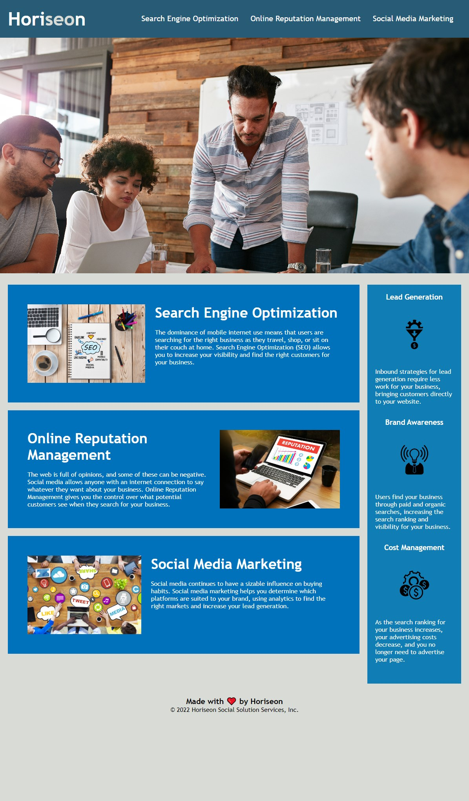

# Module 1 Code Challenge Assignment Instructions 

## Completed Mockup 
The webpage mockup in this project is for a marketing and webservices company, Horiseon, and demonstrates a the importance of accessibilty and semantic HTML.

Live URL: https://icunningham7.github.io/module01-challenge/Develop/

Mockup Preview Image:

 
## Project Requirements

### User Story

```
AS A marketing agency
I WANT a codebase that follows accessibility standards
SO THAT our own site is optimized for search engines
```

### Acceptance Criteria

```
✔️ GIVEN a webpage meets accessibility standards
WHEN I view the source code
✔️ THEN I find semantic HTML elements
WHEN I view the structure of the HTML elements
✔️ THEN I find that the elements follow a logical structure independent of styling and positioning
WHEN I view the icon and image elements
✔️ THEN I find accessible alt attributes
WHEN I view the heading attributes
✔️ THEN they fall in sequential order
WHEN I view the title element
✔️ THEN I find a concise, descriptive title
```

The completed project has passed [axe DevTools®](https://chrome.google.com/webstore/detail/axe-devtools-web-accessib/lhdoppojpmngadmnindnejefpokejbdd?hl=en) and [Google Lighthouse®](https://chrome.google.com/webstore/detail/lighthouse/blipmdconlkpinefehnmjammfjpmpbjk?hl=en) accessibility tests. 